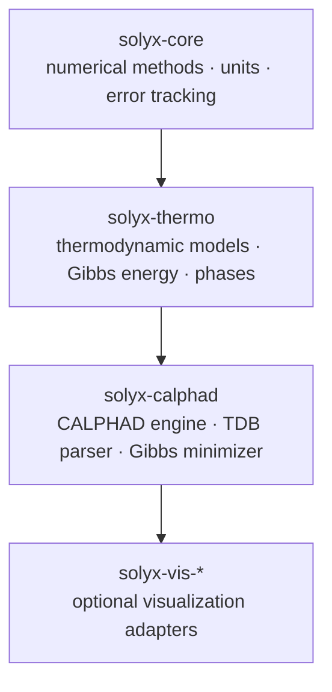
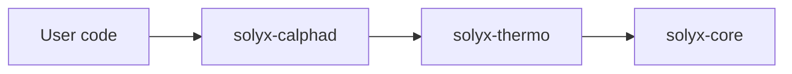
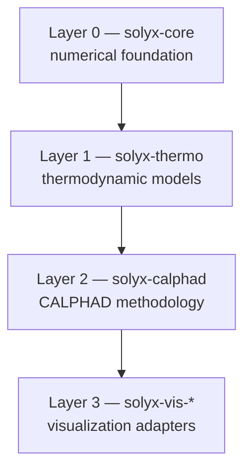

# Solyx Roadmap

Computational thermodynamics library for the JVM.  
MIT License — built to close the tooling gap in materials science on the JVM ecosystem.

---

## Architecture



---

## Module dependency



User depends only on `solyx-calphad`. Lower modules are transitive.

---

## Implementation Layers



---

## Layer 0 — solyx-core

Numerical foundation. Zero external dependencies.

### Units
- [x] `Kelvin` — temperature, conversion from Celsius / Fahrenheit
- [x] `JoulePerMole`, `JoulePerMoleKelvin` — energy and entropy
- [x] `Pressure` — Pa, bar, atm; standard pressure constant
- [x] `MoleFraction` — range-enforced [0, 1]
- [x] `PhysicalConstants` — R, N_A, k_B, F (CODATA 2018)

### Error tracking
- [x] `Interval` — interval arithmetic, reliability check, conservative bounds

### Numerical methods
- [x] `KahanSum` — compensated summation, O(ε) error regardless of n
- [x] `Derivative` — numerical differentiation (central difference)
- [x] `NewtonSolver` — root finding for single-variable functions
- [x] `BrentSolver` — robust root finding, hybrid method
- [x] `GaussLegendre` — numerical integration
- [x] `RK4Solver` — ODE solver, fixed step
- [x] `AdaptiveRK45` — ODE solver, adaptive step (Dormand-Prince)

---

## Layer 1 — solyx-thermo

Thermodynamic models. Depends on `solyx-core`.

### Elements and species
- [ ] `Element` — chemical element with atomic mass
- [ ] `Species` — element or vacancy (Va) as sublattice occupant
- [ ] `Vacancy` — explicit vacancy type for CEF

### Phase models
- [ ] `GibbsModel` — base interface: `compute(state, temperature): JoulePerMole`
- [ ] `IdealMixing` — ideal solution entropy: `-R * Σ(x_i * ln(x_i))`
- [ ] `RegularSolution` — ideal mixing + Redlich-Kister excess energy
- [ ] `CEFModel` — Compound Energy Formalism, multi-sublattice
- [ ] `IonicLiquid` — two-sublattice ionic liquid model
- [ ] `MagneticContribution` — Inden-Hillert-Jarl magnetic model

### Chemical potential
- [ ] `ChemicalPotential` — `∂G/∂n_i` for each component
- [ ] `ActivityCoefficient` — derived from chemical potential

---

## Layer 2 — solyx-calphad

CALPHAD methodology. Depends on `solyx-thermo`.

### Database
- [ ] `TdbParser` — parse Thermo-Calc `.tdb` files
- [ ] `TdbDatabase` — in-memory representation of parsed TDB
- [ ] `EndmemberParameter` — G° values per configuration
- [ ] `InteractionParameter` — L^n Redlich-Kister parameters

### Equilibrium
- [ ] `ConvexHull` — lower convex hull for binary systems
- [ ] `QuickhullStrategy` — convex hull up to ~6 components
- [ ] `SimplexStrategy` — for high-component systems
- [ ] `HullStrategy` — interface, auto-selected by component count
- [ ] `GibbsMinimizer` — two-stage: global search + local refinement
- [ ] `LagrangeMinimizer` — local refinement via Lagrange multipliers
- [ ] `EquilibriumResult` — phases, compositions, fractions, uncertainty

### Phase diagrams
- [ ] `BinaryDiagram` — phase diagram for two-component systems
- [ ] `TernaryDiagram` — phase diagram for three-component systems
- [ ] `PhaseBoundary` — liquidus, solidus, transition temperatures

### Kinetics (post-v1)
- [ ] `DiffusionModel` — diffusion between phases
- [ ] `SolidificationModel` — Scheil-Gulliver solidification

### Parameter optimization (post-v1)
- [ ] `ParameterOptimizer` — fit model parameters to experimental data

---

## Layer 3 — solyx-vis-* (post-v1)

Optional visualization adapters. No thermodynamic logic — data output only.

- [ ] `solyx-vis-jfx` — JavaFX adapter
- [ ] `solyx-vis-gdx` — LibGDX adapter
- [ ] `solyx-vis-raw` — plain data structures for custom rendering

---

## API design goals

**Kotlin-idiomatic DSL:**
```kotlin
val result = equilibrium {
    system {
        component(Fe) fraction 0.98
        component(C)  fraction 0.02
    }
    temperature = 1200.celsius
    pressure    = Pressure.STANDARD
    database    = TdbDatabase.load("steel.tdb")
}
```

**Java-friendly static API:**
```java
EquilibriumResult result = SolyxCalphad.compute(
    Alloy.of(Element.Fe, 0.98, Element.C, 0.02),
    Kelvin.fromCelsius(1200),
    Pressure.STANDARD,
    TdbDatabase.load("steel.tdb")
);
```

**LLM-friendly types** — sealed results, no ambiguous primitives, KDoc on every public API.

---

## Verification strategy

Results must be validated against known experimental data before any public release.

- Binary Fe-C system — compare against published phase diagrams
- Binary Al-Cu system — well-documented, available TDB
- Compare liquidus/solidus temperatures against NIST data
- Uncertainty bounds must be reported in all results

---

## Release plan

| Version  | Scope                                                          |
|----------|----------------------------------------------------------------|
| `0.1.0`  | solyx-core complete (units, error, numerics)                   |
| `0.2.0`  | solyx-thermo: ideal mixing + regular solution                  |
| `0.3.0`  | solyx-thermo: CEF model                                        |
| `0.4.0`  | solyx-calphad: TDB parser                                      |
| `0.5.0`  | solyx-calphad: Gibbs minimizer, binary systems                 |
| `0.6.0`  | solyx-calphad: ternary systems                                 |
| `1.0.0`  | verified against experimental data, published to Maven Central |
| post-1.0 | kinetics, parameter optimization, vis-* modules                |
